<div align="center">



[](LICENSE)
[](#running-it)
[](#inference)
[](#how-this-was-built)
[](https://github.com/Rohit-ATS)

</div>

---

Hey — I'm Rohit, the one behind this.

Every assistant you've used is **reactive**: you ask, it answers. Vivedly is the other
shape. It watches what you're actually working on, keeps a memory of how you work, and
surfaces the right thing *before* you think to ask for it.

The hard part isn't the model. It's knowing **when to speak** — and, far more often,
when to stay quiet. That restraint is the whole product.

## The idea, concretely

You're three tabs into a bug, and the error you're staring at is one you already solved
six weeks ago. A reactive assistant waits to be asked. Vivedly already knows — it saw
the stack trace, it remembers the fix, and it offers it once, quietly, in the corner.
If you ignore it, it learns that too.

## How it's built

```
src/
├── proactivity/   the trigger engine — decides IF and WHEN to surface anything
├── memory/        tiered recall: RAM → SQLite → learned patterns → vector → long-term
├── learning/      lessons drawn from what you accepted and what you dismissed
├── autopilot/     multi-step actions it can carry out once you say yes
├── inference/     model routing — local first, cloud when local won't do
├── desktop/       real OS control: windows, focus, a scripting host
├── integrations/  Gmail · Slack · Notion · GitHub
├── mcp/           an MCP server, so other agents can use Vivedly's context too
├── voice/         streaming speech in, speech out
├── renderer/      the companion orb, the overlay, the suggestion widget
└── main/          Electron main process, tray, IPC surface
```

### Memory is a hierarchy, not a vector store

Most "AI memory" is one embedding table and a similarity search. That answers *what is
this like* — but a coworker needs *what happened, when, and what did I do about it*.
So recall walks tiers in cost order and stops at the first one that can answer:

| Tier | Holds | Reached for |
| ---- | ----- | ----------- |
| **1 — hot** | the current session, in memory | anything about right now |
| **2 — warm** | SQLite, on disk | today, this week, this project |
| **3 — patterns** | recurring behaviour it has extracted | "you always do X after Y" |
| **4 — vector** | embedded episodes | fuzzy, semantic recall |
| **5 — cold** | long-term archive | the thing from six weeks ago |

Similarity is *one* of five tools here, not the whole toolbox.

### Inference

Local model first. Cloud only when the local one genuinely can't do the job — which
means the machine stays useful on a plane, and your screen contents don't leave the
device by default. Provider-agnostic: swap the backend without touching the trigger
engine.

## Running it

```bash
npm install
npm run dev        # launch with HMR
npm run typecheck  # TS across main, preload, and renderer
npm run build      # production build
```

> Native modules (SQLite, vector store) are compiled against Electron's ABI —
> run `npm run rebuild` after adding one.

Copy `.env.example` to `.env` for cloud inference, voice, and the integrations. It runs
without any of them; those paths degrade gracefully rather than crashing.

## Where this repo stands

This is the **open base** — the architecture, the memory tiers, the trigger engine, the
desktop plumbing. The current polished build lives elsewhere while it's still moving
fast, but everything structural is here.

Fork it, break it, rip out the memory layer and put something better in. If you build
something interesting on top, I'd genuinely like to see it — open an issue and tell me.

## How this was built

Written with **[Claude Code](https://claude.com/claude-code)**, directed by me. The
decisions worth arguing about are the design ones — that memory had to be a tiered
hierarchy rather than one embedding table, that the trigger engine's real job is
deciding when to stay quiet, that local inference comes first so your screen contents
don't leave the machine by default — and the agent implemented against them.

I'd rather say that up front and take the architecture questions than have you assume
otherwise.

## License

MIT — see [LICENSE](LICENSE). Do what you like with it.

<div align="center">
<sub>Built by <a href="https://github.com/Rohit-ATS">Rohit Maruri</a> &nbsp;·&nbsp; <a href="mailto:rohitmaruriats@gmail.com">rohitmaruriats@gmail.com</a></sub>
</div>
